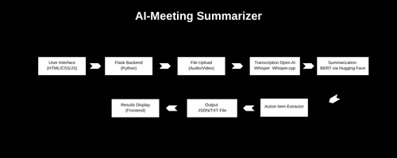

# AI-Meeting-Summarizer
Automatically transcribe uploaded meeting audio/video files, summarize them using NLP, and highlight key points/action items in a user-friendly interface.

```
AI-MeetingSummarizer/
│
├── backend/
│   ├── app.py                    # Flask backend server
│   ├── whisper_transcriber.py    # Transcription logic using Whisper
│   ├── summarizer.py             # Summarization using GPT/BERT
│   ├── utils.py                  # Helper functions
│   ├── requirements.txt
│
├── frontend/
│   ├── index.html                # File upload UI
│   ├── style.css                 # Styling
│   ├── script.js                 # Handles frontend logic (upload/display)
│
├── uploads/                     # Stores uploaded files
├── output/                      # Stores transcriptions & summaries
└── README.md
```

## ⚙️ Tech Stack

Frontend: HTML + CSS + JavaScript

Backend: Python + Flask

Speech-to-Text: OpenAI Whisper

Summarization: OpenAI GPT API or BERT-based model

Optional UI Framework: Bootstrap for styling


## 🚀 Features Breakdown

1. Upload Audio/Video File
Frontend allows .mp3, .mp4, .wav, etc.

Sent to backend for processing

2. Transcribe with Whisper
Use OpenAI Whisper or openai-whisper Python lib

Save transcription in .txt format

3. Summarize with NLP
Use OpenAI GPT (via openai API) to summarize

Alternative: Use transformers and BERT models for local summarization

4. Highlight Action Items
Use prompt engineering (e.g., "Extract action points and decisions")

Display as bullet list

## Graph LR
```
A[Upload File] --> B[Flask Backend]
B --> C[Whisper Transcription]
C --> D[Save Transcribed Text]
D --> E[Summarize with GPT]
E --> F[Extract Action Items]
F --> G[Return Summary & Actions to Frontend]
```

## 📌 Workflow Diagram with Tools/Platforms





## 🔧 Tools & Platforms Summary
| Step                      | Tools/Platform                            |
| ------------------------- | ----------------------------------------- |
| **Frontend UI**           | HTML, CSS, JavaScript                     |
| **Backend Server**        | Python, Flask                             |
| **Transcription**         | Whisper / whisper.cpp                     |
| **Summarization**         | OpenAI GPT API / HuggingFace Transformers |
| **NLP/Action Extraction** | GPT Prompt Engineering / spaCy            |
| **File Handling**         | Python `os`, `moviepy`, `ffmpeg`          |
| **Deployment** (Optional) | Render, Railway, Vercel                   |
